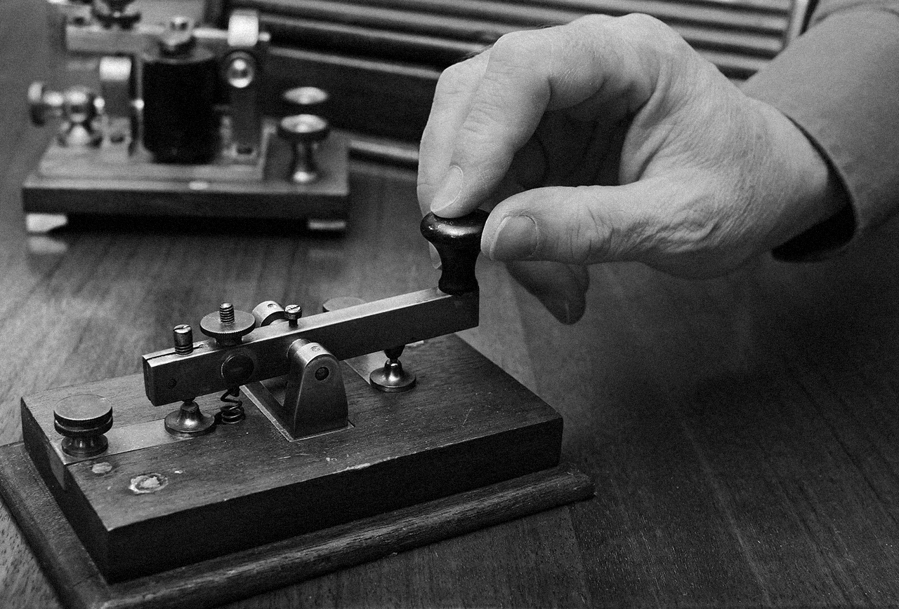

# telegrafo

[](https://greenkeeper.io/)


```
const {pulse, done, asyncGenerator: tube} = telegrafo()

const reader = async function () {
  for await (const signal of tube) {
    // (...)
  }
}

reader().then(() => {
  console.log("the line has been de-energized")
})

pulse()
pulse()
// etc
done()

```
